1. 插入 orders 表的插入方式操作描述，时间截图。

   load data local infile '/Users/cst/Desktop/数据库开发技术/作业/第一次作业/data1.txt' into table orders

   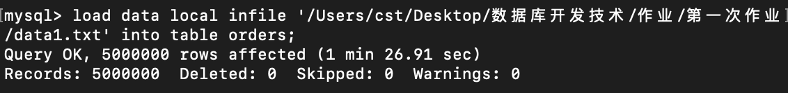

2. 插入 products 表的插入方式操作描述，时间截图。

   load data local infile '/Users/cst/Desktop/数据库开发技术/作业/第一次作业/data2.txt' into table products

   

3. 问题 1：在 orders 表中找出购买人年龄小于 20 岁的 order 列表。

    SQL：select * from orders where age < 20;

    建立索引方式：create index age_index on orders(age);

    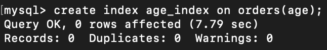

    建立索引前后执行效率截图：

    前：

    查询时间：

    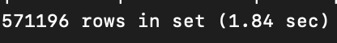

    查询计划：

    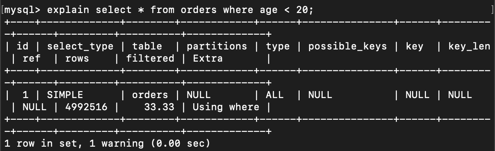

    后：

    查询时间：

    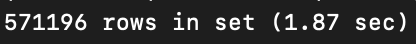

    查询计划：

    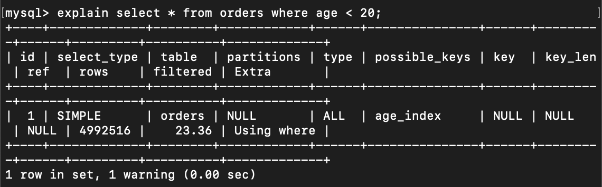

    结果：仍使用全表查询

    解释：首先、age列上的不重复值较少(70个)，选择性低(70/5000000=0.000014)，索引查询效率低下。而且本次查询到的数据量较大、索引后匹配数据行的时间开销也很大，所以最终导致使用全表查询。

    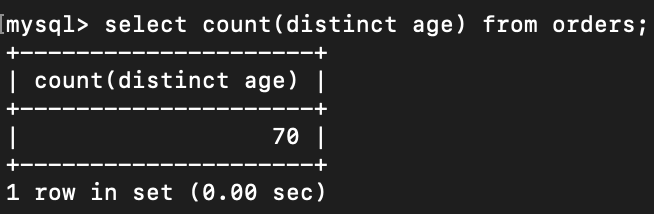

4. 问题 2：在 orders 表中找出所有姓王的人的 order 列表。

    SQL：select * from orders where name like '王%';

    建立索引方式：create index name_index on orders(name);

    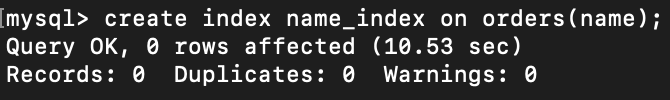

    建立索引前后执行效率截图：

    前：

    查询时间：

    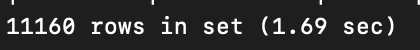

    查询计划：

    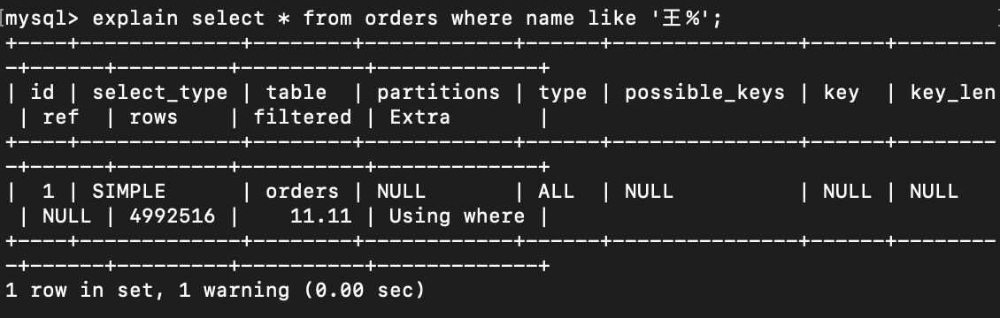

    后：

    查询时间：

    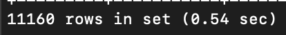

    查询计划：

    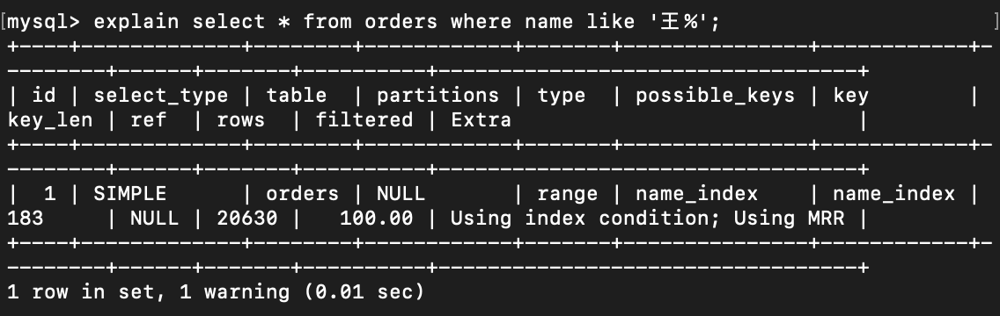

    结果：使用索引查询，大幅减小查询时间

    解释：name列选择性高，且本次查询到的数据量小

    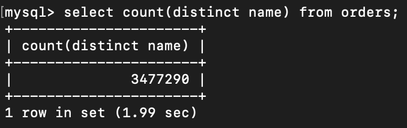

5. 问题 3：统计 orders 表中所有男性的人的数量。

    SQL：select count(*) from orders where sex = '男';

    建立索引方式：create index sex_index on orders(sex);

    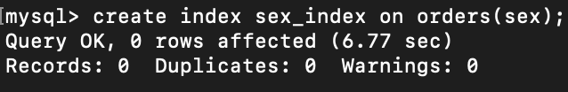

    建立索引前后执行效率截图：

    前：

    查询时间：

    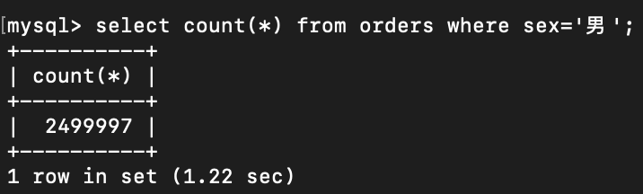

    查询计划：

    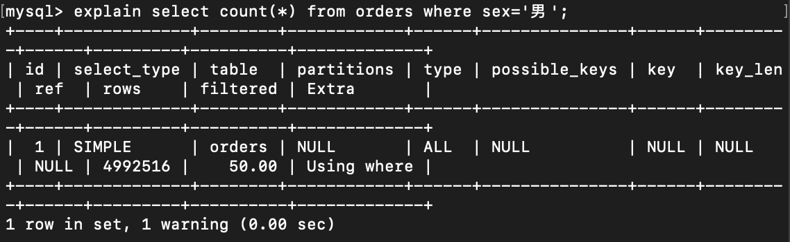

    后：

    查询时间：

    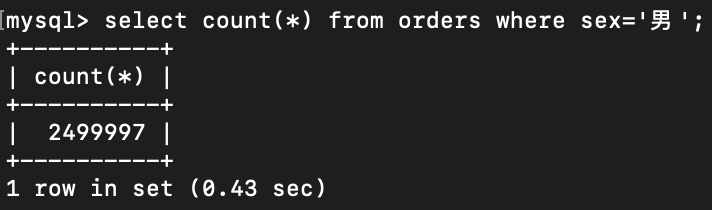

    查询计划：

    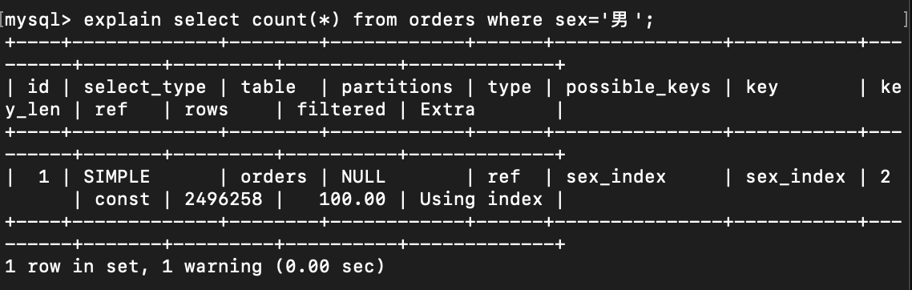

    结果：使用索引查询，减小查询时间

    解释：虽然sex列选择性低（只有 '男'、'女'两种），但该查询只需统计索引个数，无须匹配数据行，所以使用该索引可以加快查询速度。（若是查询所有性别为男的 order 列表，该索引意义不大）

6. 问题 4：在 orders 表中计算女性，姓张，年龄大于 50，且消费小于 100 的人数。

    SQL：select count(*) from orders where sex = '女' and name like '张%' and age > 50 and amount < 100;

    建立索引方式：基于sex的全值匹配和其余列的选择性的高低

    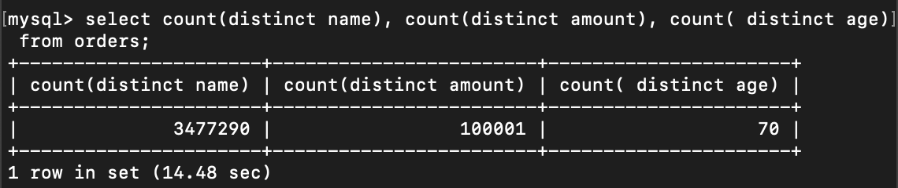

    建立如下索引：

    create index create index four_index on orders(sex, name, amount, age);

    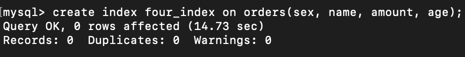

    建立索引前后执行效率截图：

    前：

    查询时间：

    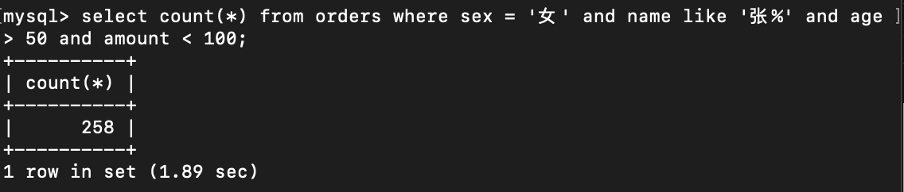

    查询计划：

    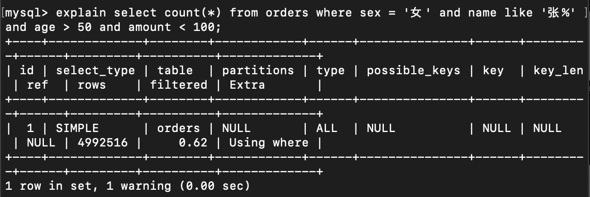

    后：

    查询时间：

    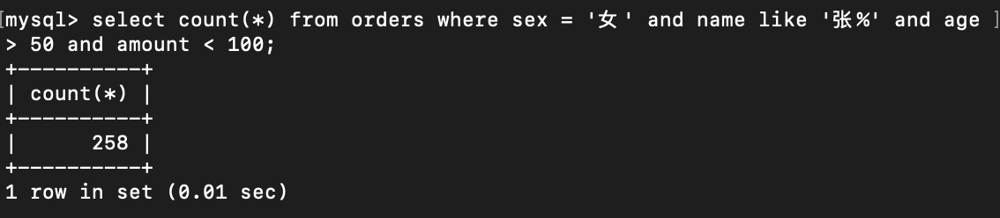

    查询计划：

    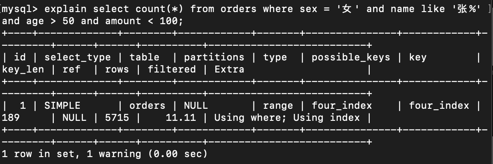

    结果：使用复合索引，大幅减小查询时间

    解释：该索引为复合索引（因为name是范围索引，所以只使用了索引的sex和name列），选择性高且只需查询索引项即可

7. 问题 5：统计 orders 表中姓名为三个字的人数。

    SQL：select count(*) from orders where name like '___';

    无法使用了索引

    理由：以%或_开头的查询无法使用索引（不符合列前缀的要求）

    <!-- 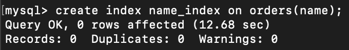 -->

    建立索引前后执行效率截图：

    前：

    查询时间：

    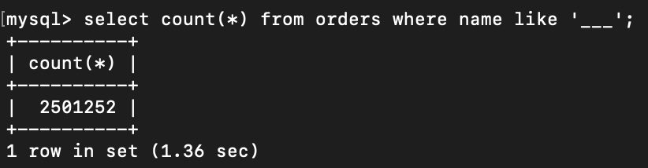

    查询计划：

    

8. 问题 6：在 products 表中查找库存大于 150 的 product 列表。
    SQL：select * from products where nums > 150;

    建立索引方式：create index nums_index on products(nums);

    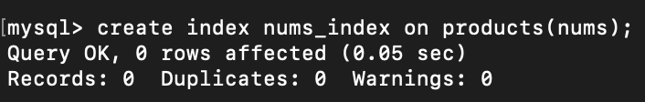

    建立索引前后执行效率截图：

    前：

    查询时间：

    

    查询计划：

    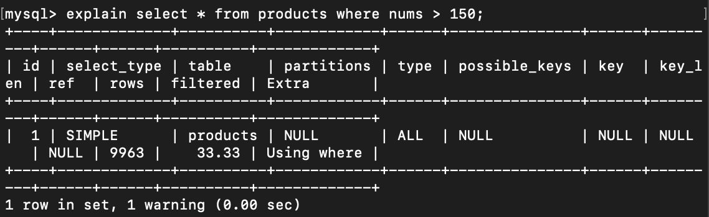

    后：

    查询时间：

    

    查询计划：

    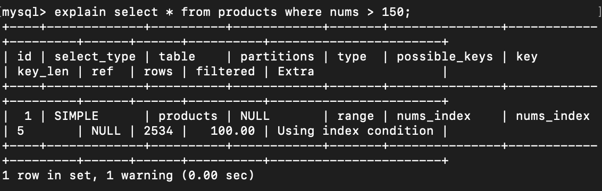

    结论：使用了索引，但数据量较小，效果不明显