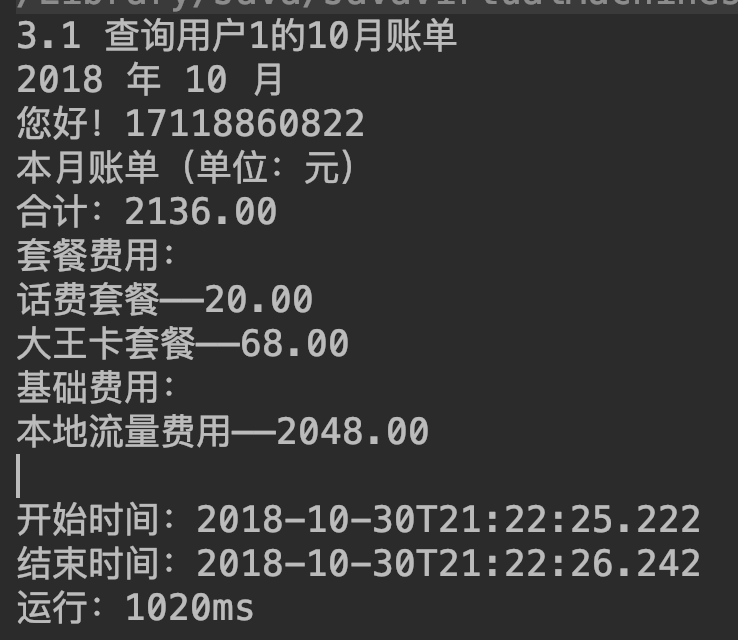

# 说明文档

[TOC]

## 1. 配置环境

| 项目      | 版本号    |
|---------|--------|
| Java    | 1.8    |
| MySQL   | 8.0.12 |
| Mybatis | 3.4.6  |

## 2. 数据库配置说明

数据库配置文件为项目文件夹resources下的jdbc:yml


其中数据库名为mobile、系统时间使用Asia/Shanghai、用户名为root、密码为123456，可根据自身情况进行更改

## 3. ER图


## 4. 初始数据

（电话基本单位为分、流量为M）

1. 10个用户(使用Faker生成的)

2. 5个套餐
    1. 话费套餐：月功能费20元，最多可拨打100分钟电话，超出时间按照0.5元/分钟计费。
    2. 短信套餐：月功能费10元，最多可发送200条短信，超出条数按0.1元/条计费。
    3. 本地流量套餐：月功能费20元，最多可获得2G流量，仅在本地使用，超出流量按2元/M计费。
    4. 国内流量套餐：月功能费30元，最多可获得2G流量，超出流量按5元/M计费。
    5. 大王卡套餐：月功能费68元，最多可拨打100分钟电话，超出时间按照0.5元/分钟计费； 最多可发送200条短信，超出条数按0.1元/条计费； 最多可获得2G流量，仅在本地使用，超出流量按2元/M计费； 最多可获得2G流量，超出流量按5元/M计费。

    对应方法仍在Service中保留，为

    ```java
    addUser(User user);

    addPlan(Plan plan);
    ```

    可自行增加数据

3. 为测试数据，还进行了以下初始化操作
    1. 用户1订购了1、3、5套餐，1、5立即生效，3下月生效。且发了7条短信，用了5G本地流量，打了13分钟电话
    2. 用户2订购了1，2套餐，立即生效；后又取消了2（次月生效）。使用了3分钟电话
    3. 用户3未订购套餐，且打了7分钟电话、使用了64M本地流量和124M国内流量

## 5. 操作说明

### 5.0

由service包下的MainService接口提供服务

```java
public interface MainService {
    /**
     * 新增用户
     *
     * @param user 用户
     */
    void addUser(User user);

    /**
     * 新增套餐
     *
     * @param plan 套餐
     */
    void addPlan(Plan plan);

    /**
     * @return 所有套餐
     */
    List<Plan> getPlans();

    /**
     * @param uid 用户id
     * @return 用户的订购记录
     */
    List<OrderVO> getOrders(int uid);

    /**
     * 订购套餐
     *
     * @param uid         用户id
     * @param pid         套餐id
     * @param nowTime     现在时间
     * @param immediately 是否立即订购
     * @return 订单id
     */
    int orderPlan(int uid, int pid, LocalDateTime nowTime, boolean immediately);

    /**
     * 取消订单
     *
     * @param oid         订单id
     * @param nowTime     现在时间
     * @param immediately 是否立即退订
     */
    void cancelPlan(int oid, LocalDateTime nowTime, boolean immediately);

    /**
     * 获取用户资费信息
     *
     * @param uid  用户id
     * @param now  现在时间
     * @param type 数据类型
     * @return 资费账单
     */
    Expense getExpense(int uid, LocalDateTime now, Type type);

    /**
     * 获取用户月账单
     *
     * @param uid   用户id
     * @param year  年
     * @param month 月
     * @return 月账单
     */
    Bill getBill(int uid, int year, int month);

    /**
     * 打电话
     *
     * @param uid       用户id
     * @param startTime 开始时间
     * @param minutes   时长
     */
    void call(int uid, LocalDateTime startTime, int minutes);

    /**
     * 发信息
     *
     * @param uid       用户id
     * @param startTime 开始时间
     */
    void sendMessage(int uid, LocalDateTime startTime);

    /**
     * 使用流量
     *
     * @param uid       用户id
     * @param startTime 开始时间
     * @param num       使用量
     * @param local     是否本地
     */
    void useData(int uid, LocalDateTime startTime, int num, boolean local);
}
```

### 5.1 查询所有套餐

设计：直接查plan表

``` sql
select * from plans;
```

对应方法：

```java
List<Plan> getPlans();
```

截图：


### 5.2 某个用户进行套餐的查询（包括历史记录）

设计：先从orders表查该用户的所有订单，再根据pid与plans表连接

```sql
select o.id, p.*, orderTime, startTime, endTime
from orders o,
     plans p
where uid = #{uid}
  and p.id = o.pid
order by orderTime
```

对应方法：

```java
List<OrderVO> getOrders(int uid);
```

截图：


### 5.3 某个用户的月账单

设计：首先确定时间段，该月第一天零点至该月最后一天的最后一刻（以月为单位），找出这个时间段已订购的可用的套餐，再找出在该月的各种数据的使用情况（以使用开始时间在该时段为基础）。

可用套餐计算套餐费用

而各种数据在减去套餐对应的数据量后若还有溢出，剩余部分进入基础资费的计算

值得注意的是，（本着人性化的态度），本系统中本地流量先使用套餐中的本地流量数，如果不够，再去看套餐中的国内流量是否有剩余（即套餐中的国内流量与实际使用的国内流量比较后的剩余）

同样之后的资费查询同样使用该算法

判断可用的套餐：

```sql
select *
from plans p
where p.id in (select pid
               from orders o
               where o.uid = #{uid}
                 and startTime < #{endTime}
                 and (endTime is null or endTime >= #{endTime}))
```

查询时间段内数据使用情况：

```sql
select *
from `usage`
where uid =#{uid}
  and type = #{type}
  and useTime >=#{startTime}
  and useTime < #{endTime}
```

代码：

```java
public Bill getBill(int uid, int year, int month) {
        try (SqlSession sqlSession = MybatisUtil.getSqlSession()) {
            Bill bill = new Bill();

            bill.setYear(year);
            bill.setMonth(month);

            MainDao mainDao = sqlSession.getMapper(MainDao.class);

            bill.setTelephone(mainDao.findUserById(uid).getTelephone());

            List<Plan> activePlans = mainDao.findActivePlans(uid, DateUtil.getNextMonthFirstDayZero(year, month));

            bill.setPlanCosts(activePlans
                    .stream()
                    .collect(Collectors.toMap(Plan::getName, Plan::getCost)));

            int planCalls = activePlans.stream().mapToInt(Plan::getCalls).sum(),
                    planMessages = activePlans.stream().mapToInt(Plan::getMessages).sum(),
                    planLocalData = activePlans.stream().mapToInt(Plan::getLocalData).sum(),
                    planNationalData = activePlans.stream().mapToInt(Plan::getNationalData).sum();

            LocalDateTime startTime = DateUtil.getThisMonthFirstDayZero(year, month);
            LocalDateTime endTime = DateUtil.getNextMonthFirstDayZero(year, month);

            long usedCalls = mainDao.findUsages(uid, Type.CALL, startTime, endTime).stream().mapToLong(Usage::getNum).sum();
            long usedMessages = mainDao.findUsages(uid, Type.MESSAGE, startTime, endTime).stream().mapToLong(Usage::getNum).sum();
            long usedLocalData = mainDao.findUsages(uid, Type.LOCAL_DATA, startTime, endTime).stream().mapToLong(Usage::getNum).sum();
            long usedNationalData = mainDao.findUsages(uid, Type.NATIONAL_DATA, startTime, endTime).stream().mapToLong(Usage::getNum).sum();

            Map<String, BigDecimal> basicCosts = new HashMap<>();

            if (usedCalls > planCalls)
                basicCosts.put("通话费用", BasicUtil.calculateBasicCallCost(usedCalls - planCalls));
            if (usedMessages > planMessages)
                basicCosts.put("短信费用", BasicUtil.calculateBasicMessageCost(usedMessages - planMessages));

            long remainData = 0;

            if (usedNationalData > planNationalData)
                basicCosts.put("国内流量费用", BasicUtil.calculateBasicNationalDataCost(usedNationalData - planNationalData));
            else remainData = planNationalData - usedNationalData;

            if (usedLocalData > planLocalData + remainData)
                basicCosts.put("本地流量费用", BasicUtil.calculateBasicLocalDataCost(usedLocalData - planLocalData - remainData));

            bill.setBasicCosts(basicCosts);
            return bill;
        }
    }
```

截图：



### 5.4 通话情况下的资费生成

设计：因为有立即退订的存在，且考虑到立即退订按百分比退款的不实际，选择方案：若立即退订，则该套餐不参与该月数据费用的计算。所以在数据使用时也只记录使用时间和使用量，之后查询时再来计算。

算法与 5.3 类型，短信、国内流量与通话情况相同，不再重复描述

对应方法：

```java
Expense getExpense(int uid, LocalDateTime now, Type type);
```

截图：


### 5.5 使用本地情况下的资费生成

设计：套餐量会加上国内流量未使用的部分，其余与5.3相同。

截图：


5.4 5.5代码：

```java
public Expense getExpense(int uid, LocalDateTime now, Type type) {
        try (SqlSession sqlSession = MybatisUtil.getSqlSession()) {
            MainDao mainDao = sqlSession.getMapper(MainDao.class);

            LocalDateTime startTime = DateUtil.getThisMonthFirstDayZero(now);
            LocalDateTime endTime = DateUtil.getNextMonthFirstDayZero(now);

            if (type == Type.CALL || type == Type.MESSAGE || type == Type.NATIONAL_DATA) {

                long useTotal = mainDao.findUsages(uid, type, startTime, endTime).stream().mapToLong(Usage::getNum).sum();

                long planTotal = mainDao.findActivePlans(uid, endTime).stream().mapToLong(x -> x.getTypeNum(type)).sum();

                BigDecimal basicCost = BigDecimal.valueOf(0, 2);

                if (useTotal > planTotal) {
                    long difference = useTotal - planTotal;

                    switch (type) {
                        case CALL:
                            basicCost = BasicUtil.calculateBasicCallCost(difference);
                            break;
                        case MESSAGE:
                            basicCost = BasicUtil.calculateBasicMessageCost(difference);
                            break;
                        case NATIONAL_DATA:
                            basicCost = BasicUtil.calculateBasicNationalDataCost(difference);
                            break;
                    }
                }

                return new Expense(now.getYear(), now.getMonthValue(), type, useTotal, planTotal, basicCost);
            } else {
                long useLocalTotal = mainDao.findUsages(uid, type, startTime, endTime).stream().mapToLong(Usage::getNum).sum();

                long useNationalTotal = mainDao.findUsages(uid, Type.NATIONAL_DATA, startTime, endTime).stream().mapToInt(Usage::getNum).sum();

                List<Plan> activePlan = mainDao.findActivePlans(uid, endTime);

                long planNationalTotal = activePlan.stream().mapToLong(x -> x.getTypeNum(Type.NATIONAL_DATA)).sum();

                long planLocalTotal = activePlan.stream().mapToLong(x -> x.getTypeNum(Type.LOCAL_DATA)).sum();

                long nationRemain = (planNationalTotal > useNationalTotal) ? planNationalTotal - useNationalTotal : 0;

                BigDecimal basicCost = useLocalTotal > planLocalTotal + nationRemain ? BasicUtil.calculateBasicLocalDataCost(useLocalTotal - planLocalTotal - nationRemain) : BigDecimal.valueOf(0, 2);

                return new Expense(now.getYear(), now.getMonthValue(), Type.LOCAL_DATA, useLocalTotal, planLocalTotal + nationRemain, basicCost);
            }
        }
    }
```

### 5.6 订购

设计：

```sql
insert into orders(uid, pid, orderTime, startTime) values (#{uid}, #{pid}, #{orderTime}, #{startTime})
```

对应方法：

```java
int orderPlan(int uid, int pid, LocalDateTime nowTime, boolean immediately);
```

截图：


### 5.7 立即退订

设计：

```sql
update orders set endTime=#{endTime} where id=#{oid}
```

对应方法：

```java
void cancelPlan(int oid, LocalDateTime nowTime, boolean immediately);
```

截图：


### 5.8 下月退订

设计：

```sql
update orders set endTime=#{endTime} where id=#{oid}
```

对应方法：

```java
void cancelPlan(int oid, LocalDateTime nowTime, boolean immediately);
```

截图：


## 6. 注意事项

1. 系统中单位均简化，通话基本单位为分钟，流量为MB

2. 为准确计算时间，关闭了Mybatis自带的缓存功能，配置文件为resource文件加下的mybatis-config.xml，可自行修改

## 7. 优化

1. 使用情况均记录在一个表中，实际情况下各有不同。应该将其分开，不仅可以增加信息字段，而且可以提高对应数据查询的速度，减少冗余

2. 订单表合并了订购退订记录，造成部分列存在到期时间字段为null，应该将订购和退订分开表存，在退订表中保留对应订购id字段